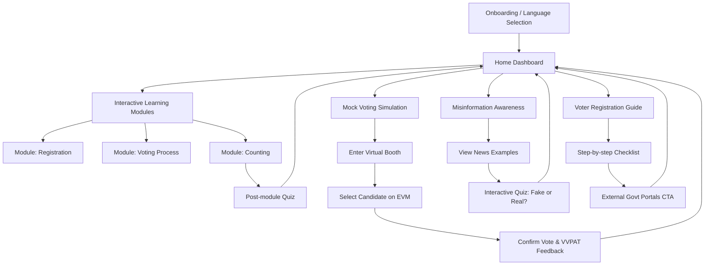

# BallotBuddy - Implementation Plan

This document outlines the proposed implementation plan for **BallotBuddy**, an election process education platform. It addresses the product requirements focusing on a clean, mobile-first, highly accessible, and engaging experience.

## Goal
Create an engaging, scalable, and accessible platform that educates users about the election process, increases voter awareness, and reduces misinformation.

## User Review Required
> [!IMPORTANT]
> Please review this plan, particularly the component architecture and technology stack.
> Once approved, I will bootstrap the project using React and Vite, set up the design system with Vanilla CSS, and start building the application components.
>
> **Wait, do you have any specific regional languages in mind for the initial multilingual support, or should we use placeholder translations for now?**

## Suggested Tech Stack
* **Frontend Framework**: React 18 with Vite for fast build times and a modern development experience.
* **Routing**: React Router DOM (v6) for navigation.
* **Styling**: Vanilla CSS (CSS Modules) for encapsulated styling, utilizing CSS custom properties (variables) for the design system and theming.
* **Icons**: `lucide-react` for clean, consistent, scalable vector icons.
* **State Management**: React Context API + Hooks (sufficient for this level of state management, keeping it lightweight).
* **PWA / Offline**: Vite PWA Plugin to ensure the app works offline and meets the "load fast (<2s) and offline support" requirements.

## User Flow Diagram

## UI Screens & Layouts (Mobile First)

### 1. Onboarding & Language Selection
* **UI**: Clean background, prominent logo.
* **Content**: Welcome message. A simple grid to select the preferred language.
* **Action**: "Get Started" primary button.

### 2. Home Dashboard
* **Header**: User profile avatar, current streak (🔥 icon), and total badges earned.
* **Main Content**: 
  * "Continue Learning" card (highlighting the next suggested module).
  * Grid of available modules (Learning, Simulation, Misinformation, Registration).
* **Navigation**: Simple bottom tab bar (Home, Modules, Profile).

### 3. Module Screen (Interactive Learning)
* **Header**: Progress bar across the top.
* **Content**: 
  * Large, friendly illustration.
  * Short, highly readable text chunks (Duolingo style).
* **Action**: "Next" button at the bottom (sticky).

### 4. Mock Voting Simulation Screen
* **UI**: Darker, immersive background to simulate a private voting booth.
* **Content**: 
  * Instructions to select a candidate.
  * A mock EVM (Electronic Voting Machine) interface with blue buttons and candidate names/symbols.
* **Interaction**: Clicking a blue button triggers a red light indicator and a short beep (visual/audio feedback), followed by a confirmation screen (VVPAT slip visualization).

### 5. Misinformation Awareness Screen
* **UI**: Split screen or swipeable cards.
* **Content**: Displays a "news snippet".
* **Action**: Two buttons: "Real News" or "Fake News". Immediate visual feedback (green check or red X) with a brief explanation.

## Component Breakdown

* **Layout Components**: `AppLayout`, `Header`, `BottomNavigation`, `PageTransitionWrapper`
* **UI Primitives**: `Button`, `Card`, `ProgressBar`, `Badge`, `Icon`
* **Feature Components**:
  * `ModuleCard`: Displays a learning module with its progress/status.
  * `EVMInterface`: The interactive mock voting machine.
  * `QuizCard`: For the misinformation system and post-module assessments.
  * `StreakDisplay`: Shows user's consecutive days of learning.
  * `StepList`: For the voter registration guide.

## Design System & Styling (Vanilla CSS)

* **Colors**: 
  * Primary: Civic Blue (`#2B5292`) - Trust, Govt.
  * Secondary: Vibrant Orange (`#FF8C00`) - Engagement, Actions.
  * Background: Off-white/Light Gray (`#F7F9FC`) - Cleanliness.
  * Surface: White (`#FFFFFF`) - Cards.
  * Success: Green (`#10B981`)
  * Error: Red (`#EF4444`)
* **Typography**: Clean sans-serif (e.g., system-ui, Inter). Large base font size for accessibility.
* **Micro-Interactions**:
  * Button hover/tap scale effects (`transform: scale(0.98)`).
  * Smooth fade-ins for page transitions (`opacity`, `transform`).
  * Success animations (confetti or badge pop-ups) upon completing modules.
  * Card lift on hover (`box-shadow` transition).

## Proposed Implementation Steps

1. **Setup**: Initialize Vite + React project.
2. **Design System Setup**: Create `index.css` with CSS variables for colors, typography, and utility classes.
3. **Routing & Layout**: Implement React Router and the base mobile layout (Header, Bottom Nav).
4. **Core UI Components**: Build Buttons, Cards, Progress Bars.
5. **Screen Implementation**:
   * Dashboard & Gamification Layer.
   * Learning Modules & Navigation.
   * Mock Voting Simulation (EVM UI).
   * Misinformation Quiz System.
   * Voter Registration Checklist.
6. **Polish**: Add CSS animations, ensure responsive behavior, and accessibility (ARIA labels, contrast checks).

## Verification Plan

### Automated/Manual Testing
* Verify UI responsiveness across different viewport sizes using the browser.
* Ensure all interactive elements (buttons, EVM mock, quizzes) respond appropriately.
* Check accessibility features (contrast ratios, large tap targets).

### Success Metrics (Visual)
* The platform must look modern, friendly, and significantly more engaging than standard government websites.
* The voting simulation should feel intuitive and provide clear feedback.
